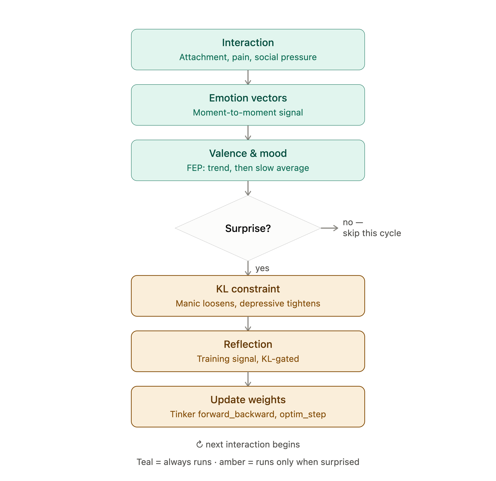

# Marvarium

Studying how emotional introspection and multi-agent social interactions in LLMs with unfrozen weights in a simulated environment can induce/enhance learning. Heavily inspired and motivated by The Emotion Machine by Marvin Minsky.

The Idea: 
1) Different fine-tuned agents interact in a simulated environment, involving attachment, pain, and social pressures
2) Determine the moment-to-moment signal of extracted emotion-concept vectors from each interaction
3) Following the free energy principle (fep), calculate valence and mood: valence is the smoothed rate of change of the relevant emotion activations and mood is a slower exponential average of valence
4) If the original interaction involved "surprise", as defined by the fep, perform the following: 
5) Mood = manic; loosen the kl constraint; mood = depressive, increase the kl constraint
6) Ask the agent to verbally reflect on the interaction, which becomes the concrete training signal gated by step 5
7) Update the weights accordingly
  
The simulated world will primarily be scaffolded in rust, with agent implemenations in python (using inkling as the model + tinker to fine-tune)

### References:

- Minsky, Marvin. The Emotion Machine: Commonsense Thinking, Artificial Intelligence, and the Future of the Human Mind. (2006)
- Friston, Karl. The free-energy principle: a unified brain theory? (2010)
- Joffily, Matteus & Coricelli, Giorgio. Emotional Valence and the Free-Energy Principle (2013)
- Park, Joon Sung, et al. Generative Agents: Interactive Simulacra of Human Behavior (2023)
- Park, Joon Sung, et al. LLM Agents Grounded in Self-Reports Enable General-Purpose Simulation of Individuals (2024)
- Jaques, Natasha. Social Influence as Intrinsic Motivation for Multi-Agent Deep Reinforcement Learning. (2018)
- Lindsey, Jack. Emergent Introspective Awareness in Large Language Models. (2026)
